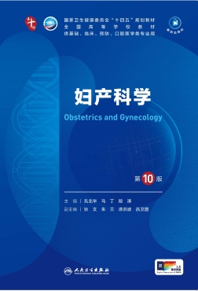

# 妇产科学 Obstetrics-and-Gynecology-PMPH-10edition
<div align="center">

> *「21世纪医学生指南」*

[](LICENSE)
[](https://claude.ai/code)
[](https://skills.sh)

<br>
> 基于人民卫生出版社《妇产科学》第10版的临床技能手册 — 187 项妇产科临床核心技能
<br>
<br>

<br>

何必苦苦读一本书<br>
只需输入一个问题，自动从课本中找到解决方案

<br>

**其他语言 / Other Languages:**

[English](README_EN.md) · [日本語](README_JP.md) · [Français](README_FR.md) · [Русский](README_RU.md)

</div>

---

## 项目简介

本项目系统整合妇产科学领域核心知识，涵盖妊娠与产科管理、高危妊娠与并发症、分娩与产后管理、妇科肿瘤、生殖内分泌与不孕不育、子宫内膜异位症与子宫肌瘤、妇科感染与炎症、外阴与阴道疾病、盆底与泌尿妇科、青春期与围绝经期保健、遗传与产前筛查诊断、女性性健康、解剖生理与基础医学、手术操作技术及教学质控等 **15 大分类**，共 **187 项关键临床技能**。

**适用人群**：妇产科医师、助产士、医学生、住院医师规范化培训学员

**参考教材**：人民卫生出版社《妇产科学》第 10 版

## 项目结构

```
Obstetrics-and-Gynecology-PMPH-10edition/
├── SKILL.md                  # 核心配置 — 187 项技能注册表
├── README.md                 # 本文档 — 项目说明与使用指南
├── <skill-name>/             # 各项技能的详细定义
│   └── SKILL.md              #   技能详情（使用时机、执行步骤、参考文档）
├── scripts/                  # 可执行工具脚本
│   ├── skill-search.sh       #   技能关键词搜索
│   └── skill-report.sh       #   技能清单报告生成
├── config/                   # 配置文件
│   └── skill-config.yaml     #   技能分类与元数据配置
└── tests/                    # 验证与测试
    └── validate-all.sh       #   完整性校验脚本
```

## 技能分类一览

| 分类 | 技能数 | 说明 |
|------|--------|------|
| 🤰 妊娠与产科管理 | 41 | 产前检查、预产期计算、胎位异常、羊水量评估、TTTS、FGR |
| ⚠️ 高危妊娠与并发症 | 19 | 子痫前期、妊娠期糖尿病、贫血、甲状腺功能减退、感染 |
| 🛏️ 分娩与产后管理 | 9 | 产后出血、恶露监测、产褥感染、产后抑郁、羊水栓塞 |
| 🧬 妇科肿瘤 | 22 | 宫颈癌、子宫内膜癌、卵巢癌、外阴癌、滋养细胞肿瘤 |
| 💊 生殖内分泌与不孕不育 | 17 | PCOS、闭经、POI、辅助生殖、促排卵、黄体功能 |
| 🔴 子宫内膜异位症与子宫肌瘤 | 5 | 内异症诊断、治疗与预防、子宫肌瘤分类管理 |
| 🦠 妇科感染与炎症 | 9 | 宫颈炎、PID、生殖器结核、HPV、HIV母婴阻断 |
| 🔵 外阴与阴道疾病 | 7 | 硬化性苔藓、萎缩性阴道炎、白带异常、阴道出血 |
| 🩺 盆底与泌尿妇科 | 4 | 压力性尿失禁、POP-Q分度、尿瘘、输卵管通液 |
| 🌸 青春期、围绝经期与老年妇科 | 5 | 青春期评估、围绝经期AUB、MHT、Turner综合征 |
| 🧪 遗传、产前筛查与诊断 | 11 | 非整倍体筛查、羊膜腔穿刺、滋养细胞肿瘤分层治疗 |
| 💕 女性性健康与心理 | 4 | 性功能障碍诊断与治疗、性反应周期、性健康教育 |
| 🫀 解剖、生理与基础医学 | 8 | 盆腔解剖、生殖胚胎发育、胎盘结构与功能、激素调控 |
| 🔪 手术与操作技术 | 3 | 腹腔镜绝育、负压吸引、宫腔镜膨宫 |
| 📚 教学、资源与质控 | 23 | 教材结构、质控指标、死亡评审、统计指标、CA125应用 |

## 快速开始

### 安装

CLI：
```bash
openclaw skills install obstetrics-and-gynecology-pmph-10edition
```

Prompt：
```bash
Before installing anything, inspect the ClawHub skill metadata and setup requirements.
If the skill asks you to install a third-party package or CLI, verify its source, maintainer, and package contents before running the install command.
Install the skill "Obstetrics And Gynecology PMPH 10edition" (xllgreen/obstetrics-and-gynecology-pmph-10edition) from ClawHub only after those checks pass.
Skill page: https://clawhub.ai/xllgreen/obstetrics-and-gynecology-pmph-10edition
Keep the work scoped to this skill only.
After install, help me finish setup from verified skill metadata.
Use only the metadata you can verify from ClawHub; do not invent missing requirements.
Ask before making any broader environment changes.
```

### 查找技能

```bash
# 按关键词搜索
bash scripts/skill-search.sh 子痫前期

# 生成技能清单
bash scripts/skill-report.sh
```

### 使用方式

每个技能包含四部分内容：
1. **使用时机** — 何时触发该技能
2. **执行步骤** — 标准化操作流程
3. **注意事项** — 禁忌与警示
4. **参考文档** — 详细补充资料

## 关于作者

**小绿绿 xllgreen(https://xllgreen.github.io)** — 九江学院临床医学院学生·科技极客

## 技术支持
<br>
PDF2App项目：https://pdf2app.cn
<br>
Microsoft Visual Studio Code：https://code.visualstudio.com/
<br>
Claude Code for VS Code：https://claude.com/
© 2026 Anthropic PBC
<br>
<br>

<br>DeepSeek API：https://platform.deepseek.com/
© 2026 杭州深度求索人工智能基础技术研究有限公司 版权所有
<br>
<br>

<br>Xiaomi Mimo API：https://platform.xiaomimimo.com/
Copyright © 2010 - 2026 Xiaomi. All Rights Reserved
<br>


## 许可证

本项目内容基于人民卫生出版社《妇产科学》第10版整理，仅供学习参考。

## Star History

<a href="https://www.star-history.com/?repos=Obstetrics-and-Gynecology-PMPH-10edition&type=date&legend=top-left">
 <picture>
   <source media="(prefers-color-scheme: dark)" srcset="https://api.star-history.com/chart?repos=Obstetrics-and-Gynecology-PMPH-10edition&type=date&theme=dark&legend=top-left" />
   <source media="(prefers-color-scheme: light)" srcset="https://api.star-history.com/chart?repos=Obstetrics-and-Gynecology-PMPH-10edition&type=date&legend=top-left" />
   
 </picture>
</a>
